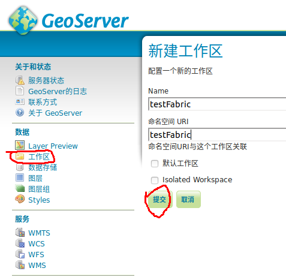
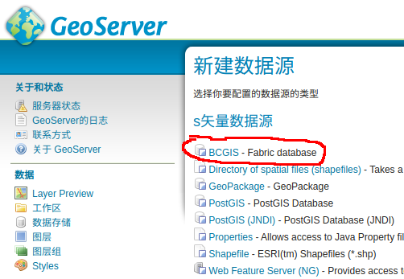
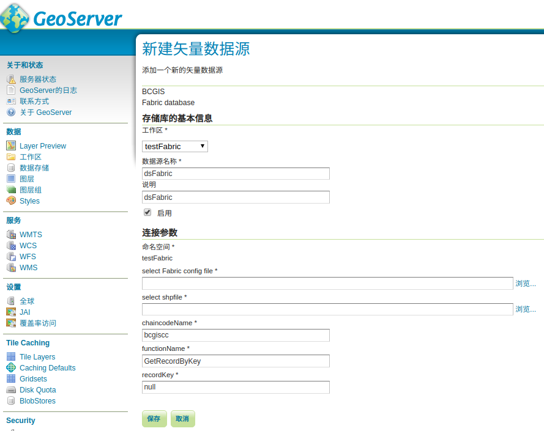
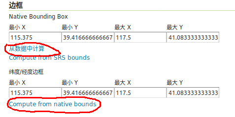
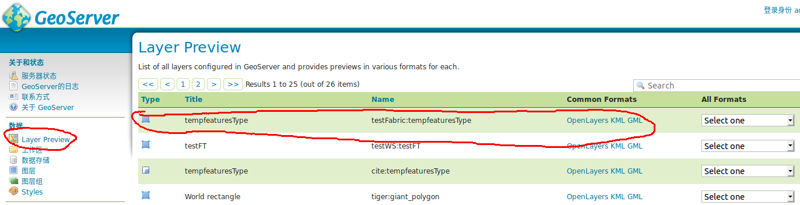
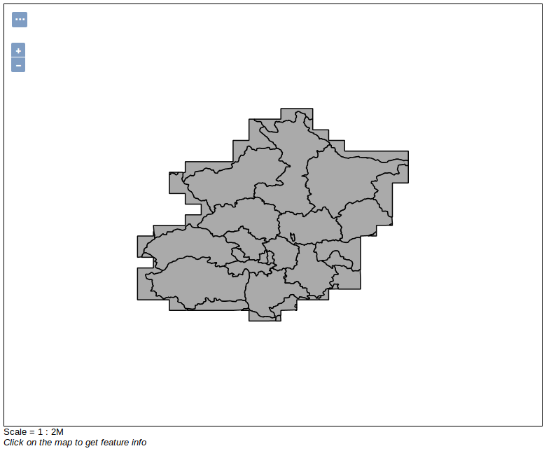

# gt-fabric

Hyperledger Fabric data plugin for GeoTools & GeoServer.

GeoTools 和 GeoServer 的 Hyperledger Fabric 数据插件，用于读取区块链上数据，以及将区块链上的数据通过 GeoServer 发布为网络地图服务。

**注意：** 目前只支持 geoserver 2.15.x 版本。

## 用法

1. 进入项目目录，运行如下命令生成插件 jar 包：

    ```
    $ gradle clean build shadowJar
    ```

    **注意：** 生成的 Jar 包路径为： `build/libs/ATLab-gt-fabric-1.0-SNAPSHOT.jar`，使用前需将 Jar 包名称改
    为 `gt-fabric-1.0-SNAPSHOT.jar`。

2. 将 Jar 包复制到 GeoServer 插件存放目录：
    ```
    $ cp <path-to>/gt-fabric-1.0-SNAPSHOT.jar <path-to-geoserver>/webapps/geoserver/WEB-INF/lib
    ```

3. 启动 Geoserver:
    ```
    $ ./<path-to-geoserver>/bin/startup.sh
    ```

4. 打开 geoserver 页面，geoserver 默认地址为 [http://127.0.0.1:8080/geoserver](http://127.0.0.1:8080/geoserver)，默认用户名 
`admin`，默认登录密码 `geoserver`，添加工作区，如下图:

    

5. 然后添加数据存储，如下图：
    
    
    
    **注意：** 只有当 `gt-fabric-1.0-SNAPSHOT.jar` 正确放入 GeoServer 插件目录时，才会有 BCGIS 数据源选项。
    
    选择 BCGIS 数据源，然后进入配置页面，如下图：
    
    
    
    配置说明：
    - **工作区：** 选择工作区。这里选择刚才新建的工作区 `testFabric`
    - **select Fabric config file:** 选择Faric配置文件。使用示例文件 `src/test/resources/network-config-test.yaml`，该文件需要
    根据网络搭建情况修改其中的节点 ID 以及证书、密钥路径。该文件的详细说明见[这里](docs/configuration.md)。
    - **select shpfile:** 选择要发布的 shape 文件。如果 shape 文件已经发布过，并且知道发布的 recordKey，则该项置空，填写 **recordKey** 
    项即可。 
    - **chaincodeName:** 链码名称。要使用的链码名称，默认名称为 bcgiscc。
    - **functionName:** 读取链上地图数据的方法名。该方法名在链码中定义，方法名称不做强制规定，开发链码时定义即可，默认bcgiscc链码中的方法名为 
    **GetRecordByKey** 。
    - **recordKey:** 地图数据的键值（Key）。该键值即地图数据存入链上的 Key 值，是地图数据的 Hash 值，具有唯一性，发布地图时系统自动生成。如果
    不知道已发布地图的 Key 值或尚未发布地图，则可以选择 shape 文件进行发布，该值需保留默认值 **null**。

6. 发布图层
    第 5 步中保存数据存储之后会自动跳转到发布图层界面，点击 `发布` 按钮即可，若未跳转，选择左侧导航栏 `图层` ->`发布新的资源` 也可以发布新图层。
    
    进入发布图层页面，需要配置如下两项，分别点击 `从数据中计算`、`Compute from native bounds` 两个超链接即可自动计算，计算完成后点击下方
     `发布` 按钮即可。
        
    
    
7. 预览图层

    选择左侧导航栏 `Layer Preview`，如下图：

    
    
    找到刚才发布的地图，选择后边的 `OpenLayers` 超链接，即可看到如下地图：
    
    


