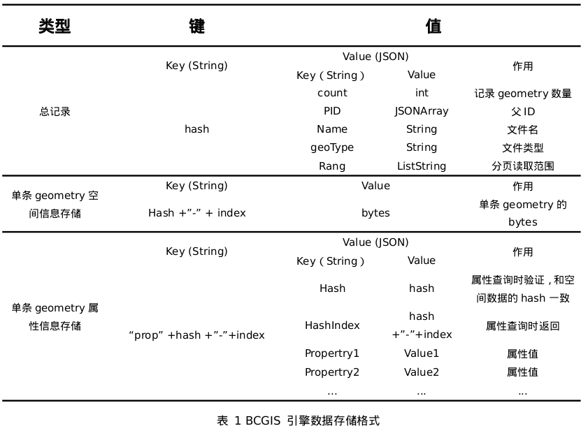

# 数据存储格式

BCGIS引擎在存储空间几何数据时，将空间几何信息和属性分开存储，它们之间的关系通过文件生成的唯一 hash 进行关联；将 shp 文件提取出空间几何信息和属性
信息之后可分为总记录、单条 geometry 空间信息和单条 geometry 属性信息三部分进行存储，具体存储格式如下所示。

关键字段说明：

1. 总记录：主要用于记录待存储文件必要的属性信息
2. 单条 geometry 空间信息存储：主要存储单个 geometry 的空间几何信息
3. 单条 geometry 属性存储：主要用于存储单个 geometry 的属性信息，并与空间信息存储的 hash 相关联
具体代码见： BCGISDataStore.java 中的 putDataOnBlockchain

